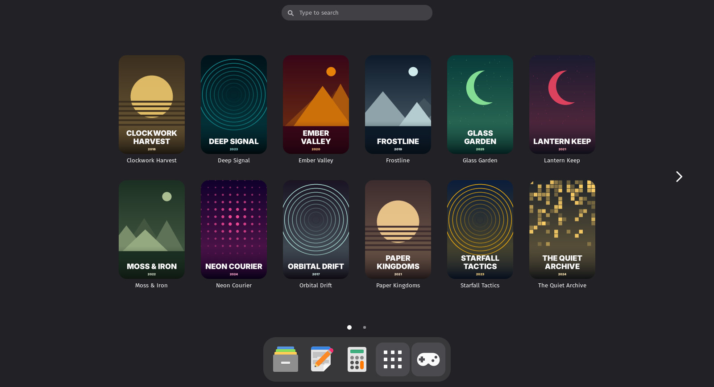
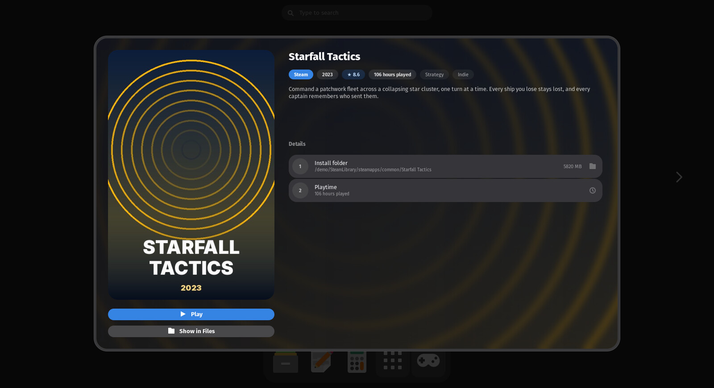
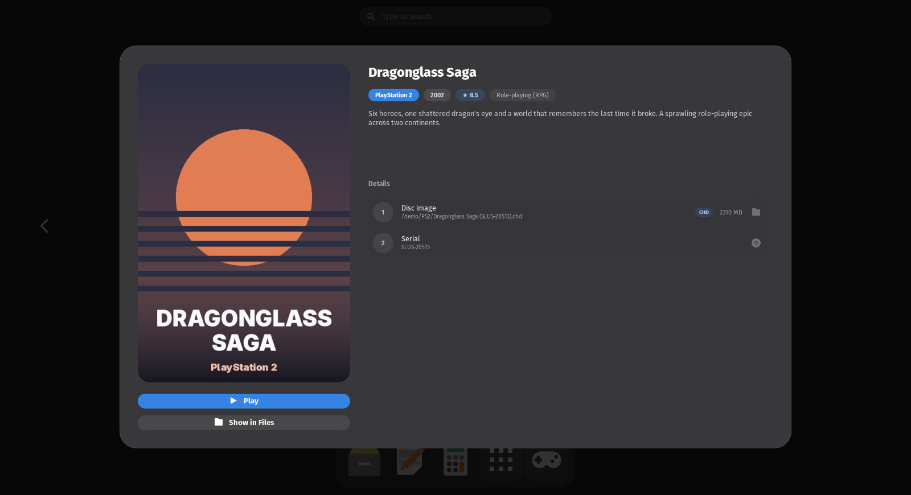
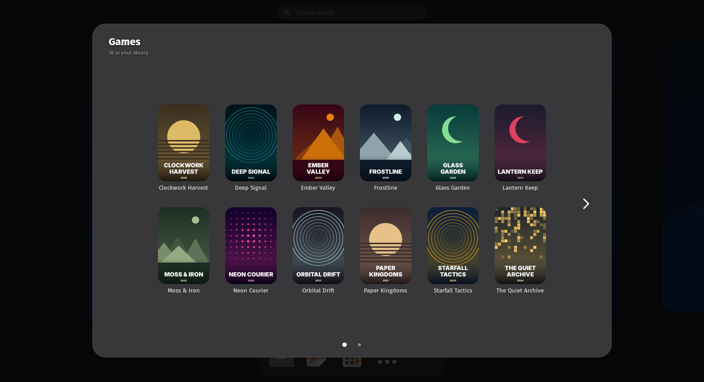
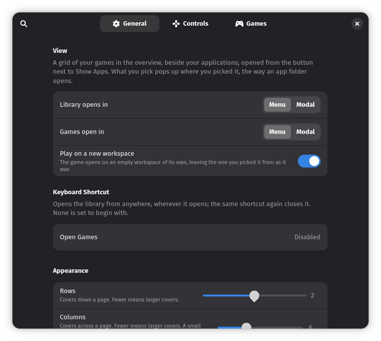
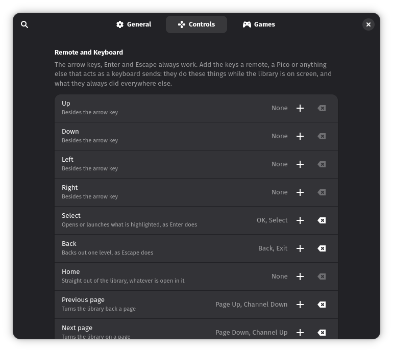
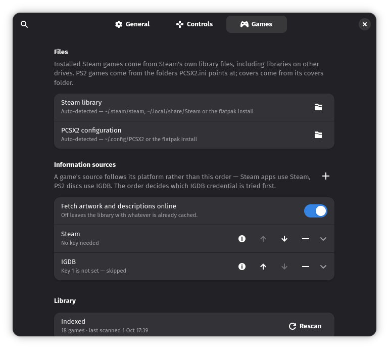

# Games Library

Your Steam and PlayStation 2 games as a library beside Show Apps: in the overview, or in
a panel that pops out of its button. A GNOME Shell extension.



It does not run games itself. A Steam game is started through Steam
(`steam://rungameid/…`, so your launch options, Proton version and overlay still apply),
and a PS2 disc is handed to PCSX2. It is a front door to the launchers you already use:
it does not install, move or remove anything.

## What it does

- **Finds your games.** Steam's own library files are read, libraries on other drives
  included, and PS2 discs come from the folders `PCSX2.ini` points at. Both are found
  without any setup.
- **Fetches the artwork.** Steam games get Valve's library art and store description;
  PS2 discs get PCSX2's own covers, or IGDB's with a free key of your own. Everything is
  cached on your machine, already scaled, so browsing never waits on the network.
- **Uses the shell's own app grid.** Same paging, swipe, keyboard, hover and focus rings
  as your apps, and a picked game opens the way an app folder does. It follows your
  accent colour and theme.
- **Works from the couch.** A game controller, a media remote or keys you choose can
  drive it, and the Guide button opens it from the desktop.
- **Leaves nothing running.** No daemon, no tray icon, no window: it draws when you open
  it.

## A game

Pick a cover and a panel zooms out of it, the way an app folder opens: the artwork, with
**Play** and **Show in Files** under it, and beside it the platform, year, rating,
playtime, genres, description and where the game is on disk.

<table>
  <tr>
    <td width="50%"></td>
    <td width="50%"></td>
  </tr>
  <tr>
    <td valign="top"><b>Steam</b>: Valve's art and store description, and the playtime
    Steam has recorded.</td>
    <td valign="top"><b>PlayStation 2</b>: PCSX2's cover or IGDB's, the disc image and
    its serial.</td>
  </tr>
</table>

## Or as a panel



Set **Library opens in** to **Modal** and the Games button pops the library out as a
panel, as an app folder pops out of its icon. Where a picked game opens is a separate
setting, so any mix of the two works:

| | Library opens in | Games open in |
|---|---|---|
| **Menu** (default) | The overview, in place of the app grid | A pop-up that zooms out of the cover |
| **Modal** | A panel that pops out of the Games button | A pop-up over everything, until you close it |

**Play on a new workspace** (on by default) starts each game on an empty workspace of its
own, leaving the one you picked it from as it was.

## Artwork sources

Artwork and descriptions come from third-party services, fetched only when the library is
scanned:

| Games | Source | Key needed? |
|---|---|---|
| Steam | Steam's store API and artwork CDN, or the art the Steam client has already cached | No |
| PlayStation 2 | PCSX2's own covers folder, then IGDB | Only for IGDB |

IGDB is run by Twitch. To use it, register a free application at
[dev.twitch.tv](https://dev.twitch.tv/console/apps) (Applications › Register) and put its
client ID and secret on the **Games** page of the preferences. The key is yours: the
extension ships none. A second IGDB key can be added as a fallback. Without a key, a PS2
disc that PCSX2 has no cover for gets a drawn placeholder.

**Fetch artwork and descriptions online** on the same page turns the network off: a scan
then uses only what is already cached.

## Controllers and remotes

The **Controls** page binds each action (the four directions, Select, Back, Home, and a
page each way) to keys and to controller buttons. The arrow keys, Enter and Escape always
work. A remote's OK, Back and Channel keys are bound by default, and a pad's D-pad, left
stick, A, B and bumpers. Controller input is acted on only while the library is on
screen, except Guide, which opens it when no window has the keyboard. Controllers are
read through libmanette.

## Alongside other extensions

Games Library keeps to its own button, settings and cache, and is built to sit beside
docks, Dash to Panel, Blur my Shell and other extensions that put a button beside Show
Apps. With Dash to Panel, its button is in Dash to Panel's panel. If another extension's
grid is up in the overview when you press **Games**, the overview closes and reopens on
your games rather than drawing one grid over the other. On a controller, Guide opens Games
Library and Menu is left free for anything else.

## Requirements

- GNOME Shell 50.
- Python 3, for the scanner, with PyGObject (GNOME's `gi` module) or
  [Pillow](https://python-pillow.org/) to scale the artwork; with neither, every game
  gets a drawn cover.
- Steam, PCSX2 or both. Either can be the Flatpak.
- libmanette, for game controllers (optional; most GNOME desktops have it).

## Privacy and network

- **What it reads:** Steam's library files, including each Steam account's
  `localconfig.vdf` for playtime, and PCSX2's `PCSX2.ini` and covers folder. None of this
  leaves your machine.
- **What it sends, and where:** only during a scan, only with **Fetch artwork and
  descriptions online** on, and only for games not already in the cache:
  - for each Steam game, its app ID to `store.steampowered.com` (the store record) and to
    `cdn.cloudflare.steamstatic.com` (the artwork the Steam client has not cached);
  - for each PS2 disc with no PCSX2 cover, when an IGDB key is set: your
    client ID and secret to `id.twitch.tv` for a token, the disc's title to
    `api.igdb.com`, and requests for its images to `images.igdb.com`.

  No Steam login is used, and nothing is sent when the library is only opened.
- **What it stores:** the library and the artwork in `~/.cache/games-library/`, and the
  settings in dconf under `/org/gnome/shell/extensions/games-library/`. **The IGDB client
  ID and secret are stored in dconf in plain text**, readable by any program running as
  you.
- **Importing a key:** if `keys/IGDB/CLIENT ID.txt` and `CLIENT SECRET.txt` exist in
  your Documents folder, the key fields get an **Import** button that reads them.
  Nothing is read until you press it.
- **To remove what it stored:** `rm -r ~/.cache/games-library` and
  `dconf reset -f /org/gnome/shell/extensions/games-library/` (this clears the keys too).

The descriptions, ratings and artwork belong to their publishers and to Valve and IGDB;
they are fetched for your own library and kept only in your cache.

## Install

It is not on extensions.gnome.org yet. From source, with `make` and
`glib-compile-schemas` (part of GLib):

```bash
git clone https://github.com/Jackicus/GNOME-Games-Library.git
cd GNOME-Games-Library
make install
```

Log out and back in (a Wayland session cannot load an extension it has never seen), then:

```bash
gnome-extensions enable games-library@jackicus
```

Then open the preferences and press **Rescan** on the **Games** page. The first scan takes
a while, since it looks every game up online; later scans fetch only what they have not
seen. The **Games** button appears beside Show Apps once the library has a game in it.

To update: `git pull && make install`, then log out and back in. To remove:
`make uninstall`.

## Preferences

`gnome-extensions prefs games-library@jackicus` opens them.

<table>
  <tr>
    <td width="33%"></td>
    <td width="33%"></td>
    <td width="33%"></td>
  </tr>
  <tr>
    <td valign="top"><b>General</b>: where the library and games open, a keyboard
    shortcut (none by default), and the look: rows, columns, alignment, corner radius
    and pop-up size.</td>
    <td valign="top"><b>Controls</b>: remote keys and controller inputs for each
    action, and whether controllers are read at all.</td>
    <td valign="top"><b>Games</b>: where Steam and PCSX2 are, where artwork comes from
    and the keys for it, and Rescan.</td>
  </tr>
</table>

## Troubleshooting

The extension logs its failures to the system journal with the prefix
`[Games Library]`. Follow it while you reproduce a problem:

```bash
journalctl -f -o cat /usr/bin/gnome-shell | grep -i 'games library'
```

The preferences window, and the scan its **Rescan** button runs, log in their own
process:

```bash
journalctl -f -o cat SYSLOG_IDENTIFIER=org.gnome.Shell.Extensions
```

From a clone, `make status` says whether it is installed and enabled and how many games
the library holds, and `make logs` follows the shell's journal filtered to it.

- **No Games button:** the library is empty. Press **Rescan**, and check the Steam and
  PCSX2 rows on the Games page point at the right folders.
- **Rescan says "Failed — see logs":** the second command above shows why.
- **A PS2 disc has no Play button:** PCSX2 itself was not found.
- **A PS2 disc has a drawn cover:** PCSX2 has no cover for it and no IGDB key is set, or
  IGDB did not find it.
- **A Steam game has no description:** Steam's store refused the lookup (it limits bursts
  of requests). The game keeps its artwork; to try again, delete
  `~/.cache/games-library/metadata/index.json` and Rescan.
- **The grid or the button is missing after a GNOME update:** the extension reaches into
  parts of the shell that can change between versions;
  [docs/private-api.md](docs/private-api.md) lists them.

## Development

`make link` installs it as a link to `src/`, `make reload` loads your edits, and
`make check` runs what CI runs. [CONTRIBUTING.md](CONTRIBUTING.md) has the rest.
[`docs/`](docs/) covers the private shell API it depends on, compatibility with other
GNOME versions, and publishing.

## Licence

GPL-2.0-or-later. See [LICENSE](LICENSE).

## Credits

The games and artwork in the screenshots are invented, drawn by
`scripts/demo_library.py`; none of them are real.

Steam is a trademark of Valve Corporation, and PlayStation of Sony Interactive
Entertainment. This project is not affiliated with or endorsed by Valve, Sony, PCSX2,
IGDB or Twitch.
